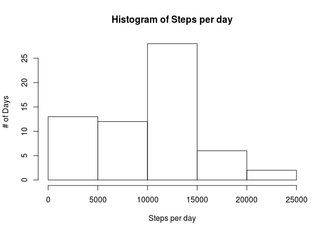
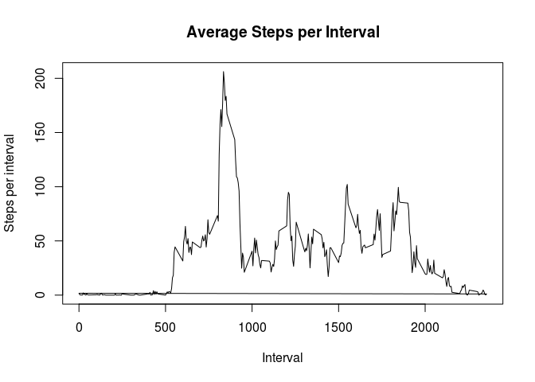
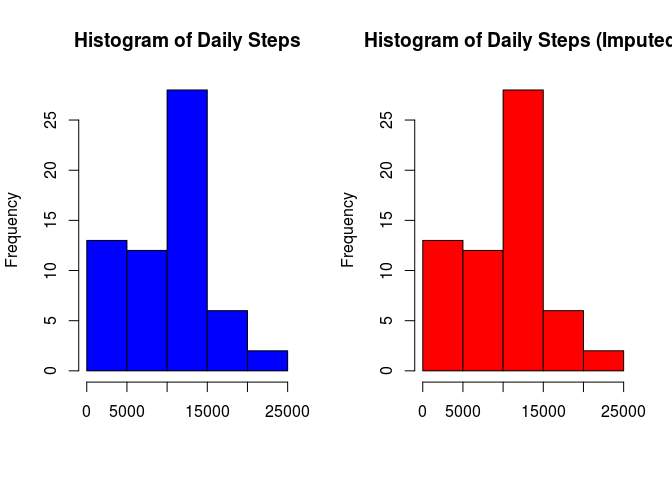
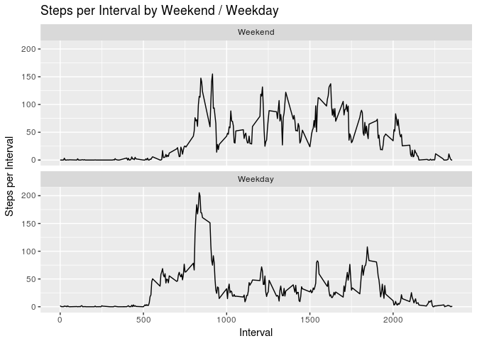

## Loading and preprocessing the data


```r
if(!file.exists("activity.csv")) {
  unzip("activity.zip")
}

d <- read.csv("activity.csv", stringsAsFactors = FALSE)
d$date <- as.Date(d$date)
```


## What is mean total number of steps taken per day?


```r
hist(s$spd, main = "Histogram of Steps per day", xlab = "Steps per day", ylab = "# of Days")
```

<!-- -->

- Mean steps per day were 37.3825996
- Median steps per day were 0


## What is the average daily activity pattern?


```r
s <- group_by(d, interval) %>% mutate(spi = mean(steps, na.rm = TRUE))
plot(s$interval, 
     s$spi, 
     type = "l", 
     main = "Average Steps per Interval", 
     xlab = "Interval", 
     ylab = "Steps per interval"
)
```

<!-- -->

- The largest steps per interval occured on 2012-10-01

## Imputing missing values


```r
s <- sapply(d, function(x) sum(is.na(x)))
```

- There are 2304 NA values in the steps data.

As recommended we will impute the median value for the day into the missing value. 


```r
backfill <- group_by(d, interval) %>% summarize(mediano = median(steps, na.rm = TRUE))
missing <- d[is.na(d$steps),]
dx <- d
dx[is.na(dx$steps), "steps"] <- backfill$mediano[
  match(
    dx$interval[is.na(dx$steps)],
    backfill$interval)
  ]

# A few manual tests to make sure we backfilled properly
# Create a few logical tests to verify what you can't see with your own eyes!
# Never trust your code! Ever!

set.seed(42)
rows <- sample(1:nrow(missing), 50)
test_rows <- row.names(missing[rows,])
res <- dx[test_rows,]
names(res)[1] <- "steps_check"
res <- merge(res, backfill) 

# These will fail if we made a mistake
stopifnot(all(res$steps_check == res$mediano)) # check that backfill was appropriate
stopifnot(all(is.na(d[test_rows,]$steps))) # missings are actually NA
stopifnot(!any(is.na(dx$steps))) # test if any NAs left over
```

### Differences from data with missings


```r
t1 <- data.frame(
  summarize(d, `Average Steps Per Day` = mean(steps, na.rm = TRUE)),
  summarize(dx, `Average Steps Per Day (Imputed)` = mean(steps)), 
  check.names = FALSE
)

t2 <- data.frame(
  summarize(d, `Median Steps Per Day` = median(steps, na.rm = TRUE)),
  summarize(dx, `Median Steps Per Day` = median(steps, na.rm = TRUE)),
  check.names = FALSE
)

par(mfrow = c(1,2))
hist(group_by(d, date) %>% summarize(total = sum(steps, na.rm = TRUE)) %>% .$total, col = "blue", main = "Histogram of Daily Steps", xlab = "")
hist(group_by(dx, date) %>% summarize(total = sum(steps)) %>% .$total, col = "red", main = "Histogram of Daily Steps (Imputed)", xlab = "")
```

<!-- -->


```r
kable(t1)
```


 Average Steps Per Day   Average Steps Per Day (Imputed)
----------------------  --------------------------------
               37.3826                          32.99954

```r
kable(t2)
```


 Median Steps Per Day   Median Steps Per Day
---------------------  ---------------------
                    0                      0

Backfilling the data with median values appears to have reduced the average. It's likely that a strategy that backfilled the last value before the NA would have been more effective, replacement with median/mean ignores the time of day determinants associated with these data (the average/median is not necessarily a good replacement, replacing with "last seen" or interpolation between last / next, would probably be better.)

## Are there differences in activity patterns between weekdays and weekends?

Weekends in general display slightly higher steps per interval suggesting that the individual is more active on the weekends and probably has a more sedentary role during the weekdays. 


```r
dx$weekday <- weekdays(dx$date)
dx$weekend <- factor(
  ifelse(dx$weekday %in% c("Saturday","Sunday"), 1, 2),
  labels = c("Weekend", "Weekday")
)


s <- dx %>% group_by(weekend, interval) %>% summarize(spi = mean(steps))

ggplot(s, aes(interval, spi)) + 
  geom_line() + 
  facet_wrap(~weekend, nrow = 2) + 
  labs(
    title = "Steps per Interval by Weekend / Weekday",
    x = "Interval",
    y = "Steps per Interval"
  )
```

<!-- -->

